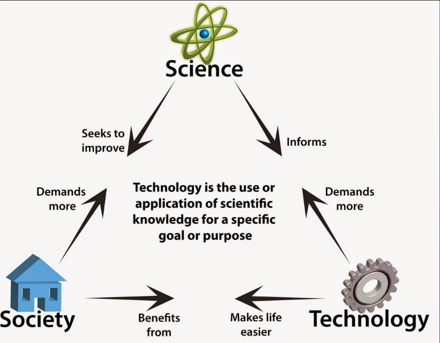

# Relationship of Science, Technology, and Society

## Common goal of a Society
* Leave peacefully.
* Have enough resources to live.
* Contributing to the society for betterment of ones life.
* Exercise right without infringing others.

## Relationship of Society and Technology
* Technology makes life easier for everybody in the society.
* Technology gives us comfort and ease of life unimaginable in the past.

## Relationship of Society and Science
* Society demands:
  * More from science
  * Solutions to our problems
  * Answer to our questions

## Relationship of Science and Technology
* Science informs what technology could be done in regard to discoveries.
* Technology converts discovery to something that can benefit the society
* Technology needs discovery to create more.

[Lecture Transcript](modules/2021-sep-27.pdf)
